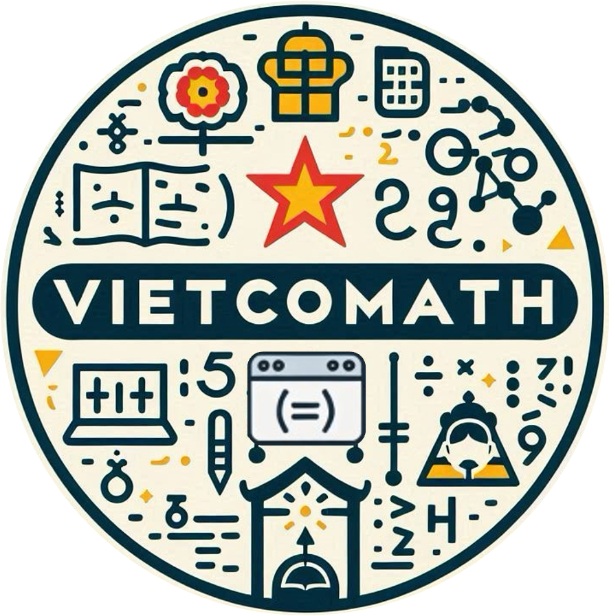
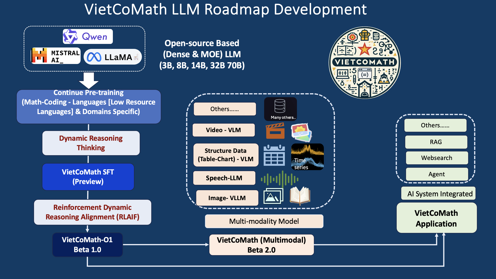

# VietCoMath
VietCoMath is Education AI Assistant Focus on Math Coding and General Multitask

<h1 align="center">
   VietCoMath: Specializing on Education AI (Coding, Math, and General Multitasks) -- Series Model Focus Dynamic Reasoning Thinking & AI-Human Interaction
</h1>

This project aims to develop a Education Tutor Assistant.
## 💡 Get help - [Q&A](https://github.com/TranNhiem/Vietnamese_LLMs/discussions) or [Discord 💬](https://discord.gg/ygkgPNSx)

     

## 🚨 VietCoMath-O1 Small(8B-Version) Demo: 🚨
+ [**VietCoMath SFT Version 2024-11**](http://140.115.53.106:8887/)

## 🚨 VietCoMath-O1 Medium (32B-Version) Demo: 🚨
+ [**VietCoMath SFT Version 2024-11**](http://140.115.53.106:8080/)

**Version 8B-Small 2024-11** (Model Based LLama3 &  LLama3.1 8B, Training using A100 GPU)
**Version 32B-Medium 2024-11** (Model Based Qwen25 32B, Training using H100 GPU)

**Coming Version** (In Progress Training)  (14B, 70B)
  
## News: 
+ [2024.11] VietCoMath Preview Instruct 8B (Based LLama 3) [Download Model](https://huggingface.co/collections/VietnamAIHub/vietcomath-o1-6751ab2514bae121c806309f)🔥
+ [2024.11] VietCoMath Preview Instruct 8B (Based LLama 3.1) [Download Model]Uploading

+ [Soon] VietCoMath Instruct 8B (Based LLama 3 Model-- RLAIF) [Coming soon]
+ [soon] VietCoMath Instruct 14B (Based Qwen25  Model-- RLAIF) [Coming soon]
  
+ VietCoMath Instruct 32B (Based Qwen25  Model-- RLAIF) [Download Model](Contact Team)
+ [soon] VietCoMath Instruct 70B (Based LLama3.3  Model-- RLAIF) [Download Model](Contact Team)

## 1. Roadmap Development of VietCoMath: 

<h3 align="center">
   VietCoMath 01 - Target Developments 
</h3>

     

## Important Benchmarks on Task Specific (Math-Coding) & General Multitask-- Các Đánh Giá Quan Trọng: 

+ Current Testing Comprehensive and Advanced English -- Vietnamese -- ChineBenchmark for STEM Categories
  
### Vietnamese Focus Benchmark 

| Benchmark Category                     | Benchmark Task Description                       | Metric     | Number of Samples |
|----------------------------------------|--------------------------------------------------|------------|-------------------|
| **General Knowledge**                  |                                                  |            |                   |
| Vietnamese Exam (From grade 6->12 & High School) | Comprehensive evaluation of multiple-choice questions for various subjects (Math, Physics, Chemistry, English, Biology, etc.) based on exam sets in Vietnam from grade 6 to grade 12 and including the national high school graduation exam | Prefix Match (Accuracy) | 33,000 |
| **Math Knowledge**                  |                                                  |            |                   |
| Vietnamese Math Exam (From grade 6->12 & High School) | Extracting the multiple-choice questions for Math subjects (Math Only) based on exam sets in Vietnam from grade 6 to grade 12 and including the national high school graduation exam | Prefix Match (Accuracy) | 5000/33,000|
| **General Knowledge**                  |                                                  |            |                   |
| VMLU Vietnamese Multitask Language Understanding | Evaluation based on multiple-choice questions covering 58 different topics, distributed across four main areas: STEM, Humanities, Social Sciences, and more. It encompasses various difficulty levels, from basic to advanced specialized knowledge, challenging models in both general knowledge and complex problem-solving. | Prefix Match (Accuracy) | 10,880 |

### English Focus Benchmark 

## 

| Category | Benchmark | \# Shots | Metric | 
| :---- | :---- | ----- | :---- |
| General | MMLU (CoT) | 0 | macro\_avg/acc |
|  | MMLU Pro (CoT) | 5 | macro\_avg/acc | 
| Steerability | IFEval |  |  |
| Reasoning | GPQA Diamond (CoT) | 0 | acc | 
| Code | HumanEval | 0 | pass@1 |
|  | MBPP EvalPlus (base) | 0 | pass@1 | 
| Math | MATH (CoT) | 0 | sympy\_intersection\_score |
| Tool Use | BFCL v2 | 0 | overall\_ast\_summary/macro\_avg/valid | 
| Multilingual (English-Vietnamese-Chinese) | MGSM | 0 | em | 
## 

## Tài Trợ & Hợp Tác (Dữ Liệu & Model Training):
  - Bạn có thể kết nối trực tiếp với Trần Nhiệm [rick.tvn@foxconn.com]().
  - Hoặc có thể chat trực tiếp ở: [LinkedIn](https://www.linkedin.com/in/tran-nhiem-ab1851125/) [Facebook](https://www.facebook.com/jean.tran.336). [X](https://twitter.com/TranRick2). [Zalo +886 934 311 751]()

